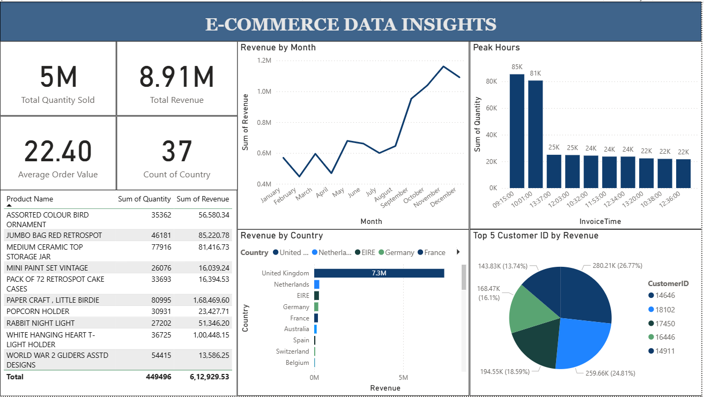

E-Commerce sales insights
his project presents a comprehensive Power BI dashboard built to analyze e-commerce sales data, offering valuable business intelligence for decision-makers.

📌 Objective

To visualize and understand trends in product performance, regional sales, and customer behavior using an interactive Power BI dashboard.

🧾 Dataset Overview

The dataset includes:

Order details (Order ID, Product, Category, Sub-category)

Sales & Profit

Customer information

Order date and Region

📊 Key Visuals and Features

Category-wise and Sub-category-wise Sales Analysis

Region-wise Sales and Profit Overview

Top-performing Products

KPIs for Sales, Profit, Quantity, and Orders

Trend Analysis over time (Monthly Sales)

Customer Segment Performance

📷 Dashboard Preview

🛠️ Tools Used

Power BI for visualization and dashboarding

Excel/CSV for raw data
