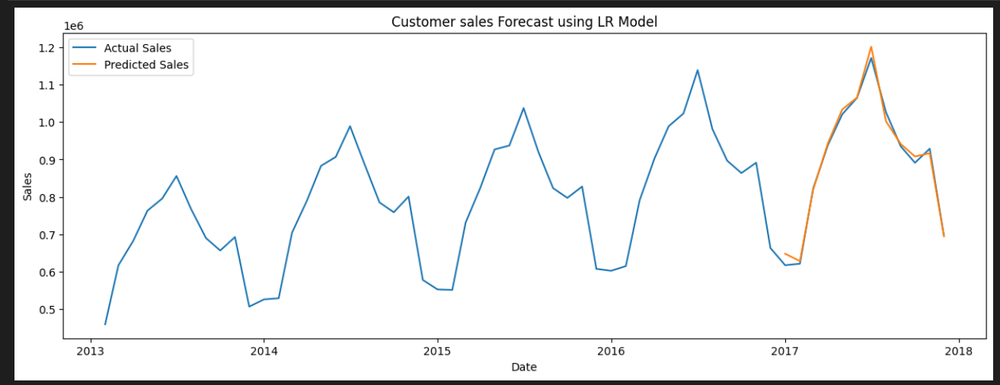

# 📈 Sales Forecasting with Linear Regression

This project uses **Linear Regression** to forecast future sales based on historical transaction data. It’s designed to help businesses plan inventory, budgets, and strategies with greater accuracy.

---

## 🎯 Objective

To build and evaluate a regression model that predicts future sales using past sales data (date, quantity, revenue, etc.).

---

## 📦 Dataset

The dataset used includes:
- Date of transaction
- Product/category
- Quantity sold
- Revenue generated

🗂️ Sample CSV: `train.csv`

---

## 🛠️ Technologies & Libraries

- Python  
- Jupyter Notebook  
- `pandas`, `numpy` – data wrangling  
- `matplotlib`, `seaborn` – visualization  
- `scikit-learn` – Linear Regression & evaluation  
- `xgboost` and `randomforest` (optional for comparison)  
- `tensorflow` (optional for advanced models like LSTM)

---

## 🧪 Workflow

1. **Data Preprocessing**
   - Handling missing/null values
   - Converting date columns
   - Feature selection

2. **Model Training**
   - Linear Regression
   - Optional: Random Forest, XGBoost, LSTM

3. **Evaluation Metrics**
   - Mean Absolute Error (MAE)
   - Mean Squared Error (MSE)
   - R² Score

4. **Visualization**
   - Actual vs Predicted Sales (line plot)
   - Trend lines & residual plots

---

## 📊 Output Example



```python
# Example code to plot predictions
plt.plot(y_test.values, label="Actual Sales")
plt.plot(y_pred, label="Predicted Sales")
plt.title("Actual vs Predicted Sales")
plt.xlabel("Time")
plt.ylabel("Sales")
plt.legend()
plt.show()

