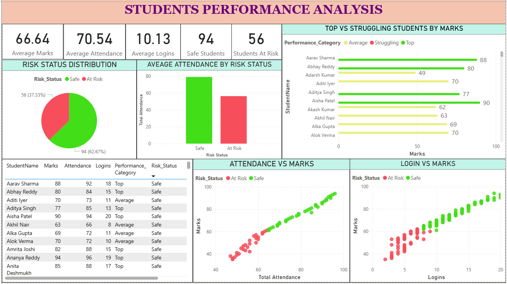

Students Performance analytics
This project presents a comprehensive **Student Performance Dashboard** created using **Power BI**, aimed at monitoring and analyzing academic performance, attendance, and login activity of students.

---

## 🎯 Objective

To identify learning trends and highlight students at risk based on their marks, attendance, and platform logins.

---

## 📌 Key Features

- **KPI Cards** for:
  - Average Marks
  - Average Attendance
  - Average Logins
  - Count of Students At Risk and Safe

- **Visuals Included**:
  - ✅ Pie Chart showing Risk Status Distribution
  - ✅ Clustered Column Chart for Average Attendance by Risk Status
  - ✅ Bar Chart comparing Top vs Struggling Students
  - ✅ Scatter Plot for:
    - Attendance vs Marks
    - Logins vs Marks
  - ✅ Tabular view with conditional formatting

- **Performance Segmentation**:
  - Students are categorized into `Top`, `Average`, and `Struggling`
  - `Risk_Status` indicates whether a student needs academic attention

---

## 📷 Dashboard Preview

---

## 🛠️ Tools Used

- Power BI Desktop
- Excel/CSV (for student data input)

---

## 📚 Learnings

- Built custom visualizations to monitor academic engagement
- Applied logical grouping for performance and risk classification
- Gained experience in KPI reporting, bar and scatter visuals in Power BI

---

> 📁 Folder: `student performance project`
